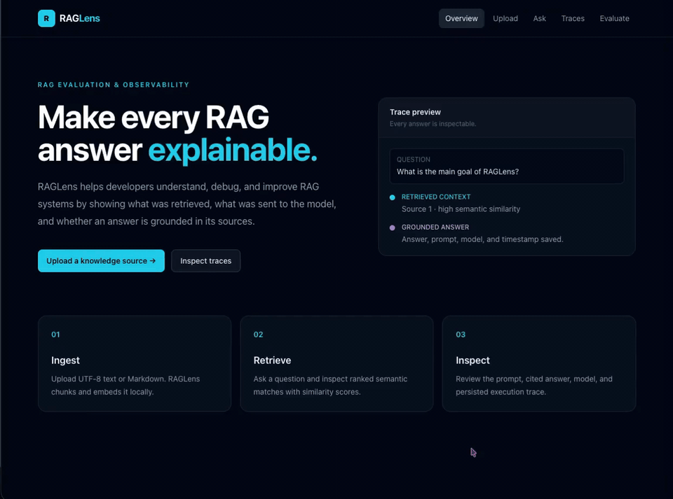

# RAGLens — RAG Evaluation + Observability Platform

RAGLens helps developers understand, debug, and improve retrieval-augmented generation systems. It shows exactly what was retrieved, what was sent to the model, what answer was generated, how long each pipeline stage took, and whether the response appears grounded in the retrieved sources.

The project is intentionally built as an inspectable developer tool rather than a generic document chatbot. Every normal question creates a persisted RAG trace, and evaluation runs make retrieval quality, citation behavior, latency, and failure cases visible across multiple questions.

## Demo video



[Download or view the full MP4 demo](docs/demo/raglens-demo.mp4)

Recommended walkthrough:

- upload a document
- ask a grounded question
- inspect retrieved chunks and similarity scores
- open the saved trace
- view the final prompt and generated answer
- run an evaluation baseline
- export a Markdown or PDF report

Its intention is to help developers answer four questions about RAG systems:

- What information did the system retrieve?
- What context and prompt were sent to the language model?
- What answer did the model generate, and which sources support it?
- How well did the system perform across multiple test questions?

## What RAGLens does

1. Ingests `.txt`, `.md`, and text-based `.pdf` documents.
2. Extracts text, splits it into overlapping chunks, and creates embeddings.
3. Stores documents, chunks, embeddings, traces, evaluation runs, and results in PostgreSQL with pgvector.
4. Retrieves the most relevant chunks for a question using vector similarity search.
5. Builds a grounded prompt and generates an answer with Ollama by default or OpenAI optionally.
6. Returns source chunks, similarity scores, timing, and citations.
7. Persists a complete trace for inspection in the React dashboard.
8. Runs labeled evaluation sets, compares run metrics, identifies retrieval failures, and exports Markdown/PDF reports.

## Architecture

```text
Documents (.txt / .md / text-based .pdf)
                ↓
      Text extraction + chunking
                ↓
 Local MiniLM embeddings / Optional OpenAI embeddings
                ↓
         PostgreSQL + pgvector
                ↓
           User question input
                ↓
     Question embedding + similarity search
                ↓
     Retrieved chunks + grounded prompt
                ↓
 Ollama generation / Optional OpenAI generation
                ↓
 Answer, citations, timing, and heuristic scores
                ↓
      Persisted trace + Evaluation results
                ↓
 React Trace Viewer + Evaluation workspace + reports
```

## Features

### Document ingestion

- Upload UTF-8 `.txt` and `.md` files.
- Upload text-based PDFs with selectable text.
- Clear error messages for corrupt, encrypted, unsupported, or scanned/image-only PDFs.
- Overlapping text chunking.
- Local embedding warm-up during API startup so the first upload is more predictable.

### Retrieval and generation

- Local embeddings with `sentence-transformers/all-MiniLM-L6-v2`.
- pgvector cosine similarity search over document chunks.
- Configurable `top_k` retrieval count.
- Grounded prompt construction that asks the model to cite `[Source N]`.
- Local answer generation using Ollama, defaulting to `llama3.1`.
- Optional OpenAI embeddings and chat generation.
- Source cards with document name, chunk index, similarity percentage, and chunk content.

### Observability

- Persisted trace for every normal question.
- Retrieved chunks, ranks, and similarity scores.
- Final prompt inspection.
- Generated answer and model identifier.
- Embedding, retrieval, generation, and total latency.
- Heuristic grounding signals:
  - faithfulness
  - context relevance
  - citation support
  - hallucination risk

### Evaluation

- Multi-question evaluation runs.
- Labeled expected-source support for Retrieval Hit Rate@k.
- Average heuristic scores across a run.
- Per-question result inspection and retrieval-failure indicators.
- Configuration snapshots for `top_k`, indexed chunk-size setting, embedding provider, and retrieval mode.
- Markdown and PDF evaluation report export.
- CLI evaluator for a reproducible JSON baseline.

## Core stack

- **Backend:** Python, FastAPI, SQLAlchemy
- **Database:** PostgreSQL + pgvector
- **Local embeddings:** sentence-transformers / `all-MiniLM-L6-v2`
- **Local generation:** Ollama / `llama3.1`
- **Optional hosted AI:** OpenAI embeddings and chat completions
- **Frontend:** React, Vite, Tailwind CSS
- **Document parsing:** pypdf
- **Local infrastructure:** Docker Compose

## Project structure

```text
RagLens/
├── .env.example                    # Local/OpenAI environment template
├── .gitignore
├── docker-compose.yml              # PostgreSQL + pgvector service
├── README.md
│
├── backend/
│   ├── requirements.txt
│   ├── app/
│   │   ├── config.py               # Typed environment configuration
│   │   ├── database.py             # Engine, sessions, pgvector setup, additive dev migrations
│   │   ├── main.py                 # FastAPI application, lifecycle, CORS, router registration
│   │   ├── models.py               # Documents, chunks, traces, evaluation runs/results
│   │   ├── schemas.py              # Request and response schemas
│   │   ├── routers/
│   │   │   ├── documents.py        # Upload, extract, chunk, embed, persist
│   │   │   ├── questions.py        # RAG answer pipeline and trace creation
│   │   │   ├── traces.py           # Trace history and detail APIs
│   │   │   └── evaluations.py      # Evaluation runs and Markdown/PDF reports
│   │   └── services/
│   │       ├── chunking.py         # Overlapping chunking logic
│   │       ├── document_text.py    # TXT/MD/PDF text extraction
│   │       ├── embeddings.py       # Local and OpenAI embedding providers
│   │       ├── evaluation.py       # Deterministic heuristic scores
│   │       ├── generation.py       # Ollama/OpenAI generation and prompt construction
│   │       ├── retrieval.py        # pgvector semantic retrieval
│   │       └── tracing.py          # Trace persistence
│   └── scripts/
│       └── run_evaluation.py       # CLI evaluation baseline runner
│
├── frontend/
│   ├── package.json
│   ├── vite.config.js
│   ├── tailwind.config.js
│   └── src/
│       ├── App.jsx                 # In-app page state and page selection
│       ├── api.js                  # Backend API client
│       ├── index.css               # Shared styles and Tailwind component classes
│       ├── components/
│       │   ├── Navbar.jsx
│       │   ├── RetrievedChunk.jsx
│       │   └── TraceCard.jsx
│       └── pages/
│           ├── Home.jsx            # Product overview
│           ├── Upload.jsx          # Ingestion workflow
│           ├── Ask.jsx             # Grounded Q&A and evidence cards
│           ├── Traces.jsx          # Persisted trace inspection
│           └── Evaluations.jsx     # Run, compare, and export evaluations
│
├── evaluation/
│   └── raglens_eval.json           # Small labeled evaluation dataset
│
└── samples/
    └── raglens-demo.md             # Demo document for local testing
```

## Local setup — free mode

Prerequisites:

- Docker Desktop
- Python 3.11+
- Node.js 18+
- [Ollama](https://ollama.com/)

### 1. Configure environment

```bash
cd /Users/chanakyag/Desktop/RagLens
cp .env.example backend/.env
```

The default configuration is free and local:

```dotenv
LOCAL_LLM_MODE=true
USE_OPENAI=false
LOCAL_EMBEDDING_MODEL=sentence-transformers/all-MiniLM-L6-v2
OLLAMA_BASE_URL=http://localhost:11434
OLLAMA_MODEL=llama3.1
```

### 2. Start PostgreSQL + pgvector

```bash
docker compose up -d
```

### 3. Start Ollama and install the model

If Ollama is not already running:

```bash
ollama serve
```

In another terminal, pull the default model once:

```bash
ollama pull llama3.1
```

### 4. Start the backend

```bash
cd backend
python -m venv .venv
source .venv/bin/activate
pip install -r requirements.txt
uvicorn app.main:app --reload --port 8000
```

The API starts at `http://localhost:8000`; interactive API documentation is at `http://localhost:8000/docs`.

### 5. Start the frontend

In another terminal:

```bash
cd /Users/chanakyag/Desktop/RagLens/frontend
npm install
npm run dev
```

Open the Vite URL, normally `http://localhost:5173`.

## Demo workflow

1. Open **Upload**.
2. Upload `samples/raglens-demo.md` or a text-based PDF.
3. Open **Ask**.
4. Ask: `What is the main goal of RAGLens?`
5. Review the answer, citations, retrieved chunks, match scores, and timing.
6. Open **Traces** to inspect the saved prompt, evidence, scores, answer, model, timestamp, and latency.
7. Open **Evaluate** and select **Run local baseline**.
8. Export the selected evaluation run as Markdown or PDF.

## Optional OpenAI mode

To use OpenAI instead of local MiniLM/Ollama, edit `backend/.env`:

```dotenv
USE_OPENAI=true
OPENAI_API_KEY=your_openai_api_key
OPENAI_CHAT_MODEL=gpt-4o-mini
EMBEDDING_MODEL=text-embedding-3-small
```

OpenAI mode uses 1,536-dimensional embeddings; local MiniLM mode uses 384-dimensional embeddings. Do not mix them in one database. Reset the local database and re-upload documents when switching providers:

```bash
docker compose down -v
docker compose up -d
```

OpenAI usage may incur charges.

## API overview

| Method | Endpoint | Purpose |
| --- | --- | --- |
| `GET` | `/api/health` | Backend liveness check. |
| `POST` | `/api/documents/upload` | Upload, extract, chunk, embed, and index a document. |
| `POST` | `/api/questions/ask` | Run RAG retrieval/generation and save a trace. |
| `GET` | `/api/traces` | List saved question traces. |
| `GET` | `/api/traces/{trace_id}` | Fetch one complete trace. |
| `POST` | `/api/evaluations/runs` | Run a labeled multi-question evaluation. |
| `GET` | `/api/evaluations/runs` | List evaluation runs. |
| `GET` | `/api/evaluations/runs/{run_id}` | Fetch an evaluation run and all case results. |
| `GET` | `/api/evaluations/runs/{run_id}/report.md` | Download a Markdown evaluation report. |
| `GET` | `/api/evaluations/runs/{run_id}/report.pdf` | Download a PDF evaluation report. |

## CLI evaluation baseline

The included CLI runner uses `evaluation/raglens_eval.json` and calls the running question endpoint.

```bash
cd backend
source .venv/bin/activate
python scripts/run_evaluation.py
```

It prints JSON with:

- case count
- Retrieval Hit Rate@k
- inline-citation coverage
- average end-to-end latency
- per-question results

Example measured local baseline:

```text
Retrieval Hit Rate@k: 100% (3/3 cases)
Inline citation coverage: 66.7% (2/3 answers)
Average end-to-end latency: 1.97 seconds
```

These values are specific to the supplied demo corpus, hardware, local model, and three-question baseline. Do not represent them as general production benchmarks.

## Evaluation score interpretation

The current scores are deterministic local heuristics, not LLM-judge or human-review scores:

| Score | Current calculation |
| --- | --- |
| Faithfulness | Fraction of answer tokens overlapping retrieved-context tokens. |
| Context relevance | Fraction of question tokens found in retrieved context. |
| Citation support | `1.0` when a source marker such as `[Source 1]` appears and evidence exists; otherwise `0.0`. |
| Hallucination risk | `1 - faithfulness`. |

They are useful reproducible grounding signals. They are not semantic proof that an answer is factually correct.

## Current limitations

- PDFs must contain extractable/selectable text. Scanned PDFs require OCR before ingestion.
- The default local model is practical for a demo but answer quality depends on the selected Ollama model and available hardware.
- Scores are deterministic heuristics, not complete automated RAG evaluation.
- Current retrieval is dense pgvector similarity search only.
- BM25, hybrid retrieval, and reranking are not implemented yet.
- A true chunk-size comparison requires re-indexing the same corpus at each chunking configuration; evaluation runs currently preserve the indexed chunk-size setting as configuration metadata.
- Local/OpenAI comparisons require separate consistently indexed databases because vector dimensions differ.
- The project is a local single-user demo and does not yet include authentication or multi-tenant security.

## Validation

Run from the repository root:

```bash
python3 -m compileall -q backend/app backend/scripts
docker compose config -q

cd frontend
npm run build
```

## Future improvements

- Semantic LLM-judge faithfulness and citation entailment scoring.
- Human evaluation rubric and feedback capture.
- Automatic corpus re-indexing for chunk-size comparison experiments.
- BM25 + dense hybrid retrieval.
- Reranking.
- Token and cost tracking for hosted providers.
- Authentication, project isolation, and durable report storage.
- Public deployment configuration.

## What this project demonstrates

RAGLens demonstrates full-stack AI engineering: document ingestion, local/hosted embeddings, vector retrieval, grounded generation, pgvector storage, traceability, local LLM workflows, latency instrumentation, evaluation baselines, report export, and a developer-facing React dashboard.
